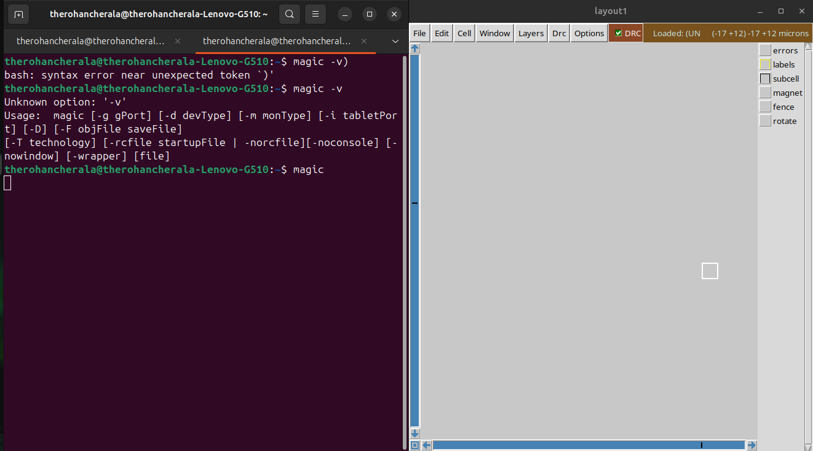

# ⚡ RISC-V SoC Tapeout Program – VSD  

Welcome to my journey through the **VSD RISC-V SoC Tapeout Program** 🚀.  
This repository documents the installation and verification of the open-source EDA toolchain required for RTL → GDS flow.  

---

## 🛠️ Toolchain Setup  

The following tools were installed successfully:  

| Tool | Purpose |
|------|----------|
| 🟣 **Yosys** | RTL synthesis |
| 🟢 **Icarus Verilog** | Verilog simulation |
| 🔵 **GTKWave** | Waveform visualization |
| 🟠 **Ngspice** | Analog/mixed-signal simulation |
| 🟡 **Magic VLSI** | Layout editing, DRC & LVS |

---

## 💻 System Requirements  

- **OS:** Ubuntu 20.04 / 22.04 (Recommended)  
- **Disk:** 10+ GB free  
- **RAM:** 4+ GB (8+ GB preferred)  

---

## ⚡ Installation Steps  

⬇️ Run these commands one by one to install the tools:  

```bash
sudo apt-get update
sudo apt-get install yosys iverilog gtkwave ngspice magic -y
```

That’s it! 🎉 All tools installed in a single step.  

---

## ✅ Verification  

Check versions with:  

```bash
yosys -V
iverilog -V
gtkwave --version
ngspice -v
magic -v
```

If you see version numbers, the installation is successful 🎯.  

---

## 📸 Proof of Installation  

### 🔹 Yosys  
<p align="center">
  <br/>
  <i>✔ Yosys installed successfully</i>
</p>  

### 🔹 Icarus Verilog  
<p align="center">
  <br/>
  <i>✔ Icarus Verilog installed successfully</i>
</p>  

### 🔹 GTKWave  
<p align="center">
  <br/>
  <i>✔ GTKWave is working fine</i>
</p>  

### 🔹 Ngspice  
<p align="center">
  <br/>
  <i>✔ Ngspice installed successfully</i>
</p>  

### 🔹 Magic VLSI  
<p align="center">
  <br/>
  <i>✔ Magic VLSI GUI launched successfully</i>
</p>  

---

## 🔮 Next Steps  

- Explore RTL-to-GDS flow 🧩  
- Run test designs using these tools 🏗️  
- Document week-wise progress in this repo 📑  

---

## 🙌 Acknowledgments  

- [VSD](https://www.vlsisystemdesign.com/) – RISC-V SoC Tapeout Program  
- Open-source EDA community 💜  
