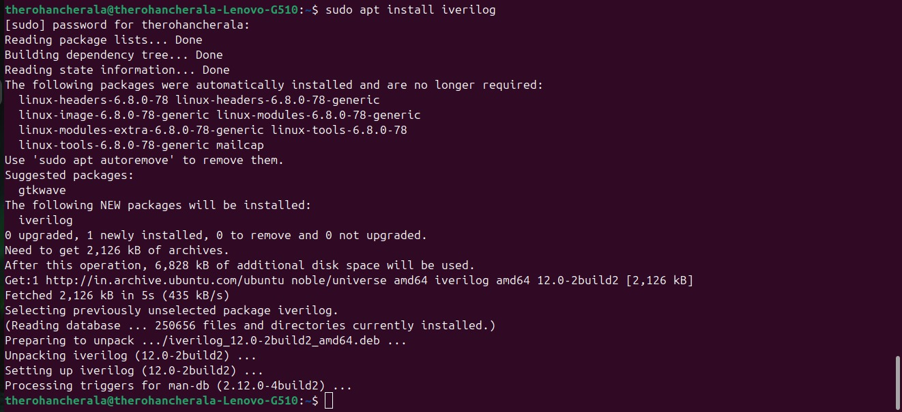
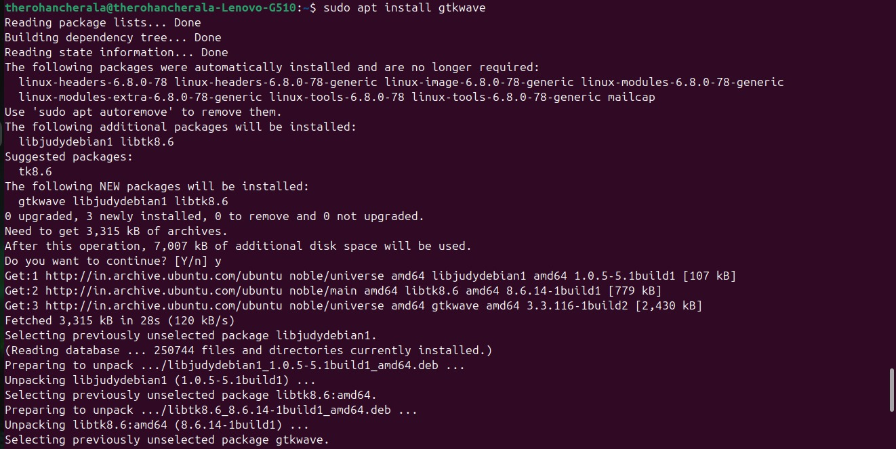
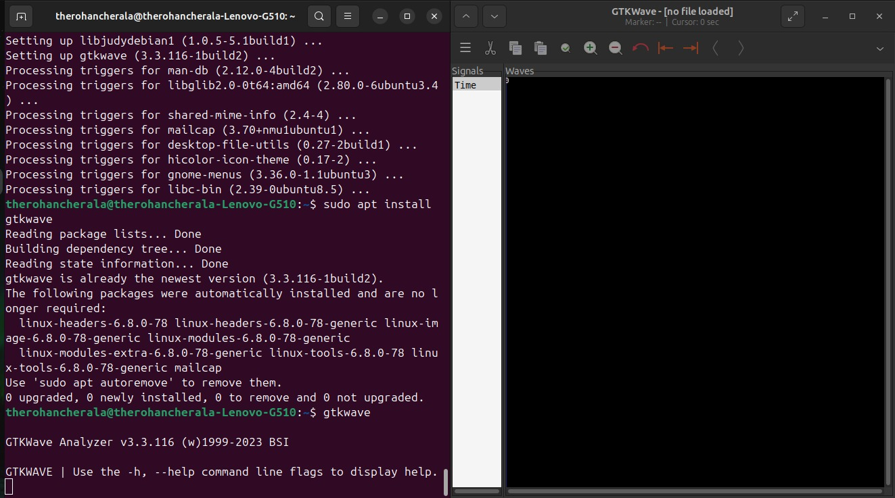
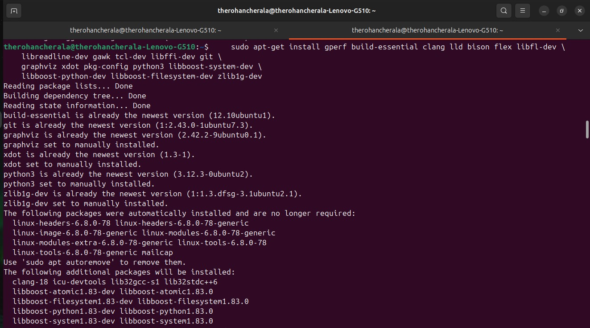
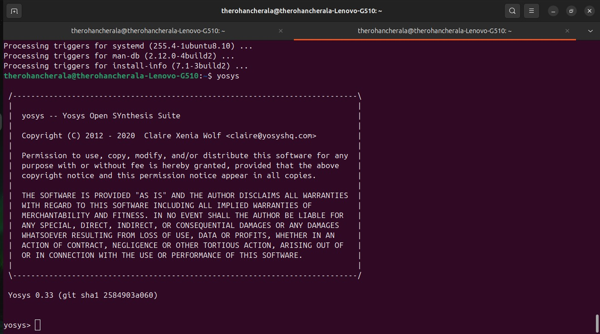

# RISC-V Reference SoC Tapeout Program VSD

## Tools Installation


#### <ins>**Iverilog**</ins>
```bash
$ sudo apt install iverilog
```



#### <ins>**gtkwave**</ins>
```bash
$ sudo apt install gtkwave
```



#### <ins>**Yosys**</ins>
```bash
$ sudo apt-get install gperf build-essential clang lld bison flex libfl-dev \
graphviz xdot pkg-config python3 libboost-system-dev \
libboost-python-dev libboost-filesystem-dev zlib1g-dev git

```




