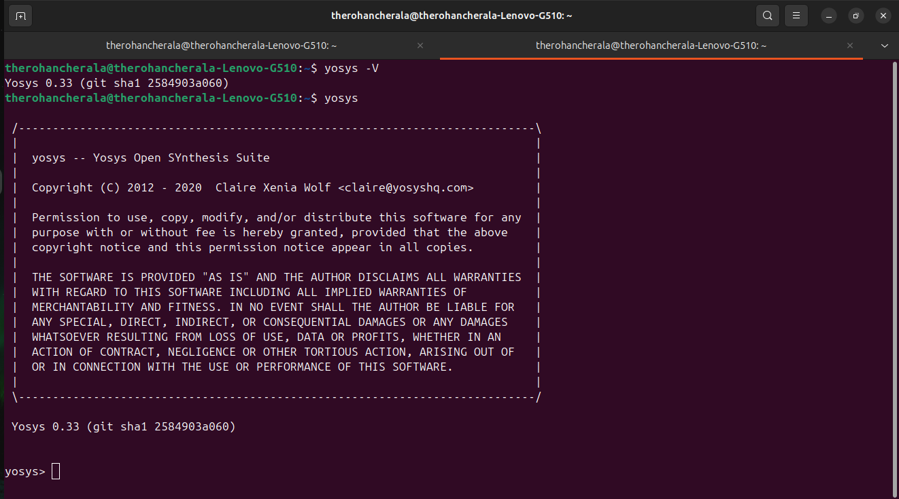
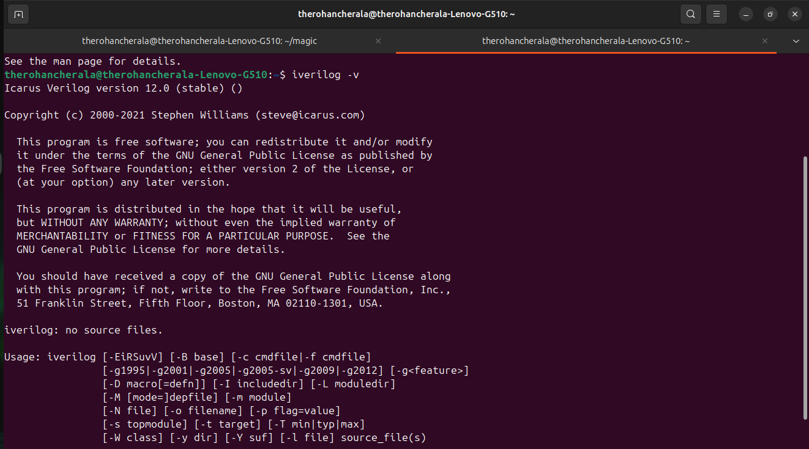
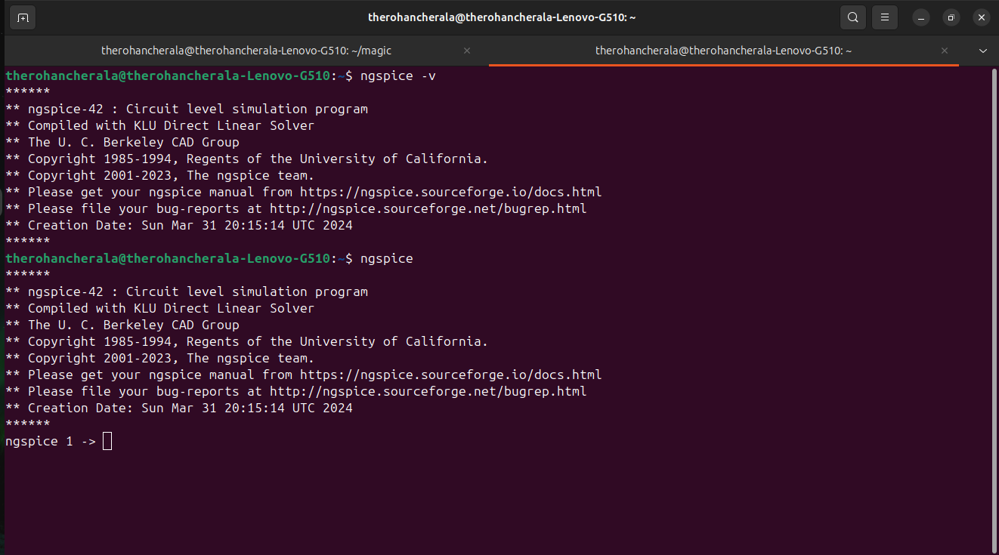

# RISC-V-SoC-Tapeout-Program_VSD

This repository documents the setup of the open-source EDA toolchain required for the **VSD RISC-V SoC Tapeout Program**.  
The tools installed here enable simulation, synthesis, and layout design in a fully open-source flow.

---

## 🚀 Tools Installed

- **Yosys** – RTL synthesis  
- **Icarus Verilog (iverilog)** – Verilog simulation  
- **GTKWave** – Waveform viewer  
- **Ngspice** – Analog/mixed-signal circuit simulation  
- **Magic VLSI** – Layout editing & DRC/LVS  

---

## 🖥️ System Requirements

- **OS:** Ubuntu 20.04 / 22.04 (Recommended)  
- **Disk:** 10+ GB free  
- **RAM:** 4 GB minimum (8+ GB recommended)  

---

## ⚡ Installation Steps

### 1️⃣ Install Yosys
```bash
sudo apt-get update
sudo apt-get install yosys -y
```

### 2️⃣ Install Icarus Verilog (iverilog)
```bash
sudo apt-get install iverilog -y
```

### 3️⃣ Install GTKWave
```bash
sudo apt-get install gtkwave -y
```

### 4️⃣ Install Ngspice
```bash
sudo apt-get install ngspice -y
```

### 5️⃣ Install Magic VLSI
```bash
sudo apt-get install magic -y
```

---

## 📸 Tool Verification

After installation, verify using:

```bash
yosys -V
iverilog -V
gtkwave --version
ngspice -v
magic -v
```

✅ If the versions display correctly, your environment is ready.  

---

## 🔬 Screenshots

Below are the verification screenshots for each tool:  

### Yosys
<p align="center">
  
</p>  

### Icarus Verilog (iverilog)
<p align="center">
  
</p>  

### GTKWave
<p align="center">
  
</p>  

### Ngspice
<p align="center">
  
</p>  

### Magic VLSI
<p align="center">
  
</p>  

---

## 📚 Acknowledgments

- [VSD](https://www.vlsisystemdesign.com/) – RISC-V SoC Tapeout Program  
- Open-source EDA community for making these tools available  
